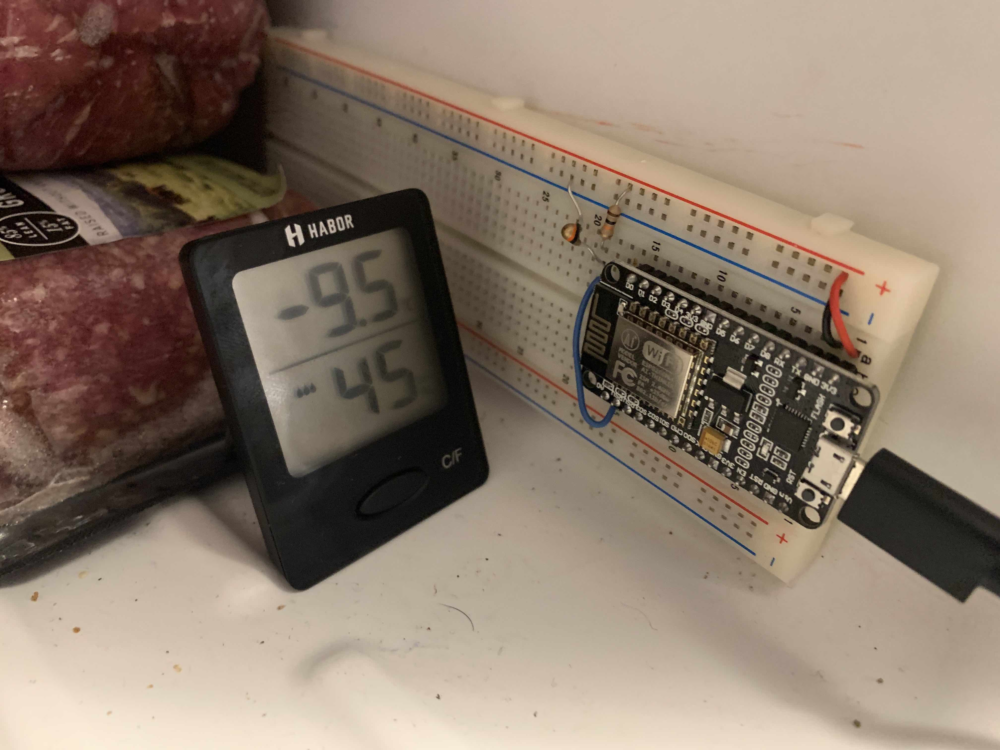
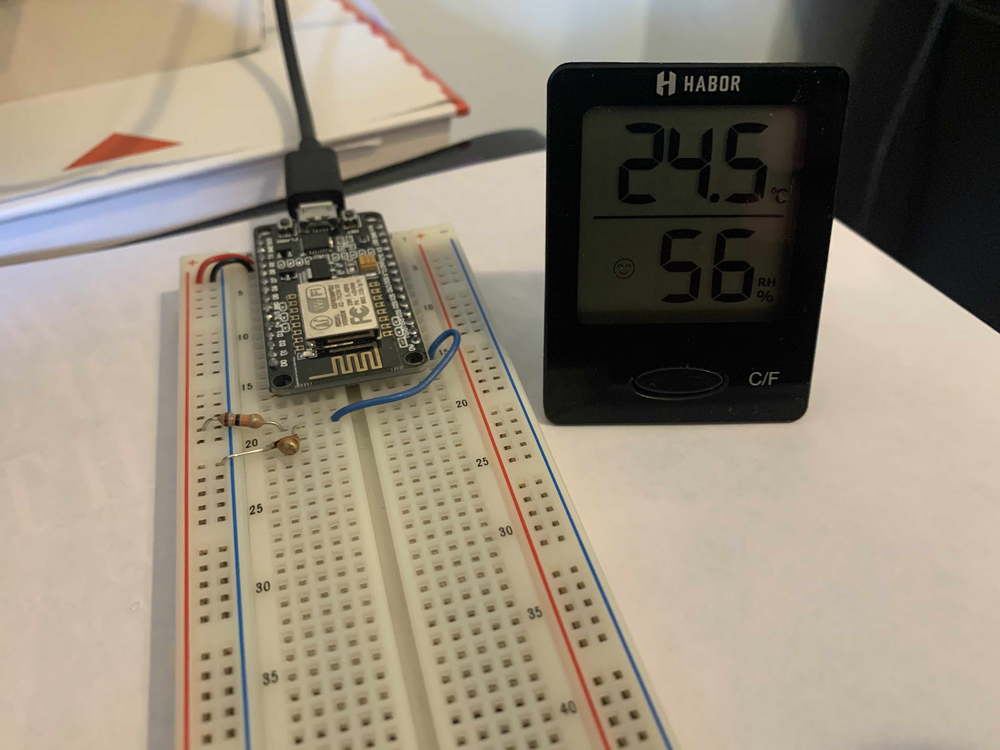

# ESP8266 Temperature Server
My bedroom gets very cold at night, so I made a network-connected temperature sensor that serves up a local website that allows me to keep track of temperature fluctuations in my room.

I wanted to keep costs low, so I built this project on the very inexpesive esp8266, an Arduino clone that can be programmed in the Arduino environment. I'm using the NodeMCU development board, which can be purchased for $3-4 online. Temperature sensing is done by measuring the voltage across a thermistor - a resistor that changes it's resistance in a predictable way with temperature. 

This was am excellent resource for getting rolling with the esp8266: https://tttapa.github.io/ESP8266/Chap01%20-%20ESP8266.html. He made a similar temperature logging server, but instead of a thermistor he used a temperature sensor IC that communiucates over serial with the esp. 

## Lessons Learned
The above resource was very helpful in getting started, but there were a few things that took me a bit of digging to figure out. First, I had to install the drivers for the USB to UART chip on the esp8266 chip from SiLabs. Download here: https://www.silabs.com/Support%20Documents/Software/Mac_OSX_VCP_Driver.zip. Second, a faulty USB cable should be the first thing to check for when serial communication isn't working. Finally, in order to uoload files to the esp's onboard filesystem, you'll need to install this: https://github.com/esp8266/arduino-esp8266fs-plugin/releases

## Thermistor math
Over small temperature deltas (5-10 degrees C) Negative Temperature Coefficient (NTC) thermistors behave in a linear way. I wanted to see how accurate I could read the tmperature across a wider range (in my freexer and at room temperatire), so a linear approxmation wouldn't do. I used the extended Steinhart-Hart approximation, with coefficients found from the manufacturers datasheet. Manufacturer claims accuracy within .1 degree C. See images below for test setup. Accuracy was better than shown - the picture in the freezer was from a different test where the device was allowed to cool further.

## Images

